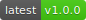
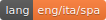
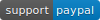
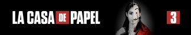
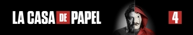
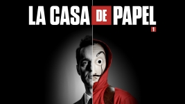
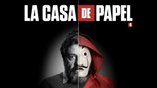

<h1 align="center">
  
</h1>

<h4 align="center">
  Artworks and .nfo files for the Netflix version of the show.
</h4>

<p align="center">
  <a href="#changelog"></a>
  <a href="#"></a>
  <a href="https://paypal.me/dreadlord"></a>
</p><br>

<h4 align="center">
  <a href="#documentation">Documentation</a> •
  <a href="#artworks">Artworks</a> •
  <a href="#downloads">Downloads</a> •
  <a href="#versions">Versions</a> •
  <a href="#changelog">Changelog</a> •
  <a href="#contributing">Contributing</a> •
  <a href="#links">Links</a> •
  <a href="#credits">Credits</a> •
  <a href="#license">License</a>
</h4>

---

## Documentation
Thanks for interesting, sadly internet databases don't have a great option for different versions of a tv show like in this case, so i made an entire project on it based on the files made by **[Karellen](https://forum.kodi.tv/showthread.php?tid=351738)**.

This project include artworks and .nfo files (Kodi v18+) of the first 4 seasons, but feel free to use/change it as you want. Any help to translate/export to other media center or spread this project is highly appreciated, see **[Contributing](#contributing)**.

Read the other sections for important info, instructions are described in each version release notes.

If you don't know nothing about Kodi, .nfo files or artwork... well, these may help you:

- **[Google](https://www.google.com)**
- **[Kodi: Quck Start](https://kodi.wiki/view/Quick_start_guide)**
- **[Kodi: Create a video library](https://kodi.wiki/view/HOW-TO:Create_Video_Library)**
- **[Kodi: .nfo files](https://kodi.wiki/view/NFO_files)**
- **[Kodi: .nfo files on tv shows](https://kodi.wiki/view/NFO_files/TV_shows)**
- **[Kodi: artworks](https://kodi.wiki/view/Artwork)**

## Artworks
<details>
  <summary><b>Preview</b></summary>

These are the artworks that you will find in this project:

`3784x700 banner.jpg`


`1944x1104 clearart.png`


`1440x558 clearlogo.png`


`2592x1458 landscape.jpg`


`1000x1500 poster.jpg`


`4325x800 seasonXX-banner.jpg`



`1920x1080 seasonXX-landscape.jpg`



`1000x1500 seasonXX-poster.jpg`


These are the fanarts included:

`3840x2160/5120x2880 fanartXX.jpg`


These fanart are **only** included in the **[Vault Pack](#downloads)**:

`3840x2160 fanartXX.jpg` 


</details>

## Downloads

### Instructions for .nfo downloads
Extract the attached zip file (it contains a folder named with the version), then add your video files on it, divided by season, be sure that every episode file name is like `<Money Heist in your language> (2017) SXXEXX` no exception, or something may not work (**[read here](https://kodi.wiki/view/Naming_video_files)**). Now you can move the `<Money Heist in your language> (2017)` folder into your library and if you already had it just do the "scan for new content" option in it's library source menu, otherwise simply rescan your library.
<br>
<br>

### English
<a href="https://github.com/matteoveronesi/artworks/releases/download/cdp-v1.0.0-art-eng/cdp-v1.0.0-art-eng.zip" style="all:unset; cursor:pointer;"></a>
<br>
cdp-v1.0.0-art-eng.zip (9,3MB)

<a href="https://github.com/matteoveronesi/artworks/releases/download/cdp-v1.0.0-nfo-eng/cdp-v1.0.0-nfo-eng.zip" style="all:unset; cursor:pointer;"></a>
<br>
cdp-v1.0.0-nfo-eng.zip (25,9MB)
<br>
<br>

### Italian
<a href="https://github.com/matteoveronesi/artworks/releases/download/cdp-v1.0.0-art-ita/cdp-v1.0.0-art-ita.zip" style="all:unset; cursor:pointer;"></a>
<br>
cdp-v1.0.0-art-ita.zip (9,4MB)

<a href="https://github.com/matteoveronesi/artworks/releases/download/cdp-v1.0.0-nfo-ita/cdp-v1.0.0-nfo-ita.zip" style="all:unset; cursor:pointer;"></a>
<br>
cdp-v1.0.0-nfo-ita.zip (26,0MB)
<br>
<br>

### Spanish
<a href="https://github.com/matteoveronesi/artworks/releases/download/cdp-v1.0.0-art-spa/cdp-v1.0.0-art-spa.zip" style="all:unset; cursor:pointer;"></a>
<br>
cdp-v1.0.0-art-spa.zip (9,4MB)
<br>
<br>

### Extra Packs
<a href="https://github.com/matteoveronesi/artworks/releases/download/cdp-v1.0.0-pck-vlt-zxx/cdp-v1.0.0-pck-vlt-zxx.zip" style="all:unset; cursor:pointer;"></a>
<br>
cdp-v1.0.0-pck-vlt-zxx.zip (10,2MB)
<br>
<br>

## Versions
The project is divided based on the content in different version types:

- **cdp-vX.X.X-nfo-lang**
- **cdp-vX.X.X-art-lang**
- **cdp-vX.X.X-pck-name-lang**

Version names meaning:
- **[cdp]** is the code used for this project, include it when adding an issue
- **[vX.X.X]** is the **[SemVer](http://semver.org/)** code of the content's version
- **[lang]** is the **[ISO 639-2/B](https://www.loc.gov/standards/iso639-2/php/code_list.php)** code of the content's language
- **[nfo]** means it contains only .nfo files
- **[art]** means it contains only artworks
- **[pck]** means it's an extra content pack, may contain different files
- **[name]** is the 3-characters name of the extra pack

## Changelog 

### [v1.0.0](#)

<details>
  <summary><b>Changes</b></summary>
  <ul>
    <li>Removed the <b>fileinfo</b> tags from the episode files</li>
    <li>Added <b>director</b> & <b>credits</b> tags where missing</li>
    <li>Updated show ratings</li>
    <li><b>S03E04-05</b> fixed wrong titles (they were taken from TMDb which are different from Netflix)</li>
    <li>Added/updated <b>S01-02</b> episode plots with the ones from Netflix</li>
    <li>Removed unnecessary/wrong tags</li>
    <li>Added artworks</li>
  </ul>
</details>

<details open>
  <summary><b>Releases</b></summary>
  <ul><b>
    <li><a href="https://github.com/matteoveronesi/artworks/releases/tag/cdp-v1.0.0-nfo-eng">cdp-v1.0.0-nfo-eng</a></li>
    <li><a href="https://github.com/matteoveronesi/artworks/releases/tag/cdp-v1.0.0-nfo-ita">cdp-v1.0.0-nfo-ita</a></li>
    <li><a href="https://github.com/matteoveronesi/artworks/releases/tag/cdp-v1.0.0-art-eng">cdp-v1.0.0-art-eng</a></li>
    <li><a href="https://github.com/matteoveronesi/artworks/releases/tag/cdp-v1.0.0-art-ita">cdp-v1.0.0-art-ita</a></li>
    <li><a href="https://github.com/matteoveronesi/artworks/releases/tag/cdp-v1.0.0-art-und">cdp-v1.0.0-art-spa</a></li>
    <li><a href="https://github.com/matteoveronesi/artworks/releases/tag/cdp-v1.0.0-pck-vlt-zxx">cdp-v1.0.0-pck-vlt-zxx</a></li>
  </b></ul>
</details>

## Contributing
Contributing is always appreciated. Here's a list of things **You** can do, credited of course.
Remember, the **#1** thing that help the most is always reporting a problem or suggest ideas, do it through the **[issues](https://github.com/matteoveronesi/artworks/issues)** page.

### Gettin' ready
Before starting you may want to take a better look at some wikis about **.nfo** and **artworks** on Kodi.
- **[.nfo files](https://kodi.wiki/view/NFO_files)**
- **[.nfo files on tv shows](https://kodi.wiki/view/NFO_files/TV_shows)**
- **[artworks](https://kodi.wiki/view/Artwork)**

### Translate this Wiki in your language
Just download this file and translate it as you want and upload it on the **[issues](https://github.com/matteoveronesi/artworks/issues)** page making a new issue, be sure to add a comment, how you translated it, **language** code/name and the **version** you used (latest is cdp-v1.0.0).

### Translate the .nfo files in your language
Download the latest **[nfo](#downloads)** version in your favourite language. The tags that needs to be edited in each file are listed below:

**tvshow.nfo**
```html
<title></title>
<showtitle></showtitle>
<plot></plot>
<tagline></tagline>  (you may not find this but you can easily translate it)
<status></status>
```

**La Casa de Papel (2017) SXXEXX.nfo**
```html
<title></title>
<plot></plot>
```

Using Netflix's site as a main resource is a must. If the show is not present in your language you can translate it (google & co is not liked but accepted, please specify it when you submit your work). The **[Links](#links)** below should be enough.

If you think that other tags should be modified, please post a new **[issue](https://github.com/matteoveronesi/artworks/issues)** about it.

### Translate the artworks in your language
If you provide me the original logo i can make them. You can find it on the **[Netflix page](https://www.netflix.com/title/80192098)**, just right click on the logo then "save image as" and upload it on the **[issues](https://github.com/matteoveronesi/artworks/issues)** page making a new issue, be sure to add a comment and **language** code/name.

### Spread the love
Last but not least feel free to post about this project where you want, and if so include the link at this page (https://github.com/matteoveronesi/artworks/blob/master/lacasadepapel/README.md) as content may and will change over time.
Thanks for reading.

## Links
- **[Netflix](https://www.netflix.com/title/80192098)**
- **[IMDB](https://www.imdb.com/title/tt6468322)**
- **[TMDb](https://www.themoviedb.org/tv/71446-la-casa-de-papel)**
- **[TVDB](https://www.thetvdb.com/series/la-casa-de-papel)**
- **[Fanart.tv](https://fanart.tv/series/327417/la-casa-de-papel/)**

## Credits
- **English .nfo files** by **[Karellen](https://forum.kodi.tv/showthread.php?tid=351738)**
- **Flags** by **[Roundicons](https://www.flaticon.com/packs/flags-2)**, **[Freepik](https://www.flaticon.com/free-icon/world_52349)** 

## License
This project is licensed under the GPL-3.0 License. See the **[LICENSE](../LICENSE)** file for details.
